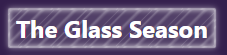
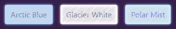
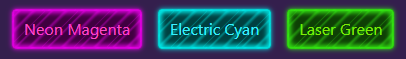

# \<frosted-glass\> Web Component
This effect creates a frosted glass appearance over any element, simulating the look of ice crystals forming on a cold window. It uses a combination of blur, subtle noise, and crystalline patterns to achieve a realistic icy overlay.

Screenshots:







See demo for dynamic examples with melted effect on hover.
[https://mycolaos.com/demos/frosted-glass/](https://mycolaos.com/demos/frosted-glass/)

## Features

- Realistic frosted glass effect (blur, crystalline pattern)
- Subtle melting animation on hover (via melted state)
- Handles parent border offsets for perfect overlay
- Pointer events are disabled for the glass layer (parent handles interaction)
- Lightweight, no external dependencies
- Easy integration as a drop-in web component

## Component API

### Attributes

- `color-rgb`: Sets the color of the frosted glass effect. Accepts `r,g,b` value. For example, `color-rgb="255,0,0"` for red. Default is `255, 255, 255` (white).
- `opacity`: Adjusts the opacity of the frosted effect. Accepts a number between 0 (fully transparent) and 1 (fully opaque). This value controls the opaqueness of the frosted glass background color. Note: the crystalline patterns and highlights may use different opacity levels relative to this value for a more realistic effect.
- `z-index`: Sets the z-index of the frosted glass layer. Accepts any valid CSS z-index value (number or 'auto').
- `melted-color-rgb`, `melted-opacity`, `melted-z-index`: Optional. Set the color, opacity, or z-index for the melted (hover) state. Same format as above. If omitted, defaults to the base value.

### Behavior

- On hover (pointer enters parent), the glass enters the "melted" state, using melted-* attributes if set.
- Pointer events are disabled for the glass layer; use events on the parent element.
- The glass overlays the parent's border, not just the content box.
- The component automatically sets the parent element's position to `relative` if needed for correct overlay, and restores it on disconnect.

## Usage

1. Include the `frosted-glass.js` script in your HTML file:
```html
<script src="frosted-glass.js"></script>
```
Or install via npm:
```bash
npm install @mycolaos/frosted-glass
```
Or yarn:
```bash
yarn add @mycolaos/frosted-glass
```

2. Use the `<frosted-glass>` tag inside elements you want to apply the effect to:
```html
<button class="frosty-button">
  <!-- Your content here -->
  <frosted-glass></frosted-glass>
</button>

<button class="button-with-white-background">
  <!-- Your content here -->
  <frosted-glass color-rgb="0,187,255" melted-color-rgb="255,255,255" melted-opacity="0.25"></frosted-glass>
</button>

<p>
  Some text with a frosted glass effect.
  <frosted-glass color-rgb="0,200,255" opacity="0.5" melted-opacity="0.8"></frosted-glass>
</p>
```

